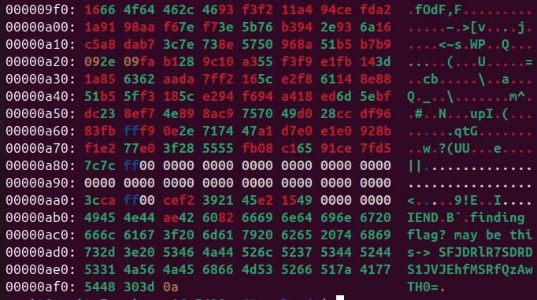

# Cyber Security: HackRushCTF'25

username: anvit26

### Misc

- __Find me__
I just went to the EII website. Right clicked on the slider and clicked on inspect element. There was a comment.
```html
<!-- flag? SFJDVEZ7IV9MMFYzX0hAQ0tSVSRIfQ== -->
```
The string in the comment is in base64 format. I just decoded it using a website that decodes base64 strings.

```sh
FLAG: HRCTF{!_L0V3_H@CKRU$H}
```
- __Crack and Hack__
Using an online MD5 hash decoder, I found out the string to be 12345678. I went to the mess portal and filled in the email-id i.e. hacker@iitgn.ac.in as email-id and 12345678 as the password. I found out that the roll number is 24116969. Then, I just had to append /24116969 to the IR&P council server.

```sh
FLAG: HRCTF{@LW@Y$_U$3_$TR0N6_P@$$W0RD}
```

### Forensics

-__cant_fast_forward_security_01__

I opened the repository and found that it was a git repository. I understood that I would have to check just the commits made in the month of March.
```sh
git log --since="2025-03-01" --until="2025-03-31"
```

I found a commit that seemed promising.

```sh
commit a64c7cde789fb5e47f67081afb400cc23da2a8e4
Author: Alex Bakon <akonradi@signal.org>
Date:   Wed Mar 19 15:50:15 2025 -0400

    Exclude root key from WebSocketRequestMessage
```

```sh
git log -p a64c7cde789fb5e47f67081afb400cc23da2a8e4
```
And I found something like:

```sh
@@ -145,8 +145,7 @@ mod test {
                 WebSocketRequestMessage {
                     verb: Some("POST".to_string()),
                     path: Some("/v1/verification/session".to_string()),
-                    body: Some(b"{\"number\":\"+18005550101\",
-                        \"root_key\": \"0adf1c39f4035d3acd7496f9ed9023e56573b239ce4631d4553f90428bbe1641\"}".into()),
+                    body: Some(b"{\"number\":\"+18005550101\"}".into()),
                     headers: vec!["content-type: application/json".to_string()],
                     id: Some(0),
                 }

```

I found the root key.

```sh
FLAG: HRCTF{0adf1c39f4035d3acd7496f9ed9023e56573b239ce4631d4553f90428bbe1641}
```

- __cant_fast_forward_security_02__

In this one, I tried using:

```sh
grep "key"
```

```sh
grep "root_key"
```

I found some json files which had some root key. But, it showed incorrect when I submitted that. I used git status to see which files are different from the ones the current version. I found some strings that seemed promising but none of them worked. I couldn't solve this problem.

- __Benedict_and_William__
Searching on Google, I got to know that on DOS, lines end at \r\n while in Linux, only \n is used.
```sh
file Two_Gentlemen_of_Verona.txt
```
```sh
ASCII text, with CRLF, LF line terminators
```

I got to know that CRLF means DOS line terminators and LF stands for Linux Terminators. I had to search a little bit on how to find out which lines ended with \r\n and which lines ended on \n. I found out that cat -v <file_name> convert all \r to ^M on Stack Overflow.
Using this, I could only verify having lines written in Windows and didn't get the line numbers.

On searching more, I found that 
```sh
awk '{ if (sub(/\r$/, "")) print NR }' filename
```
prints the line numbers ending with \r.

I got the output as
```
641
1324
1510
2080
2164
2310
3009
4158
```

```sh
FLAG: HRCTF{0641_1324_1510_2080_2164_2310_3009_4158}
```

### Stego

- __legos_to_logos__
I just had to do:
```sh
xxd tech.png
```


The flag was at the end and I just had to decode it from base64 to string.

```sh
FLAG HRCFT{H4CKRU$H_1$_C00L}
```


